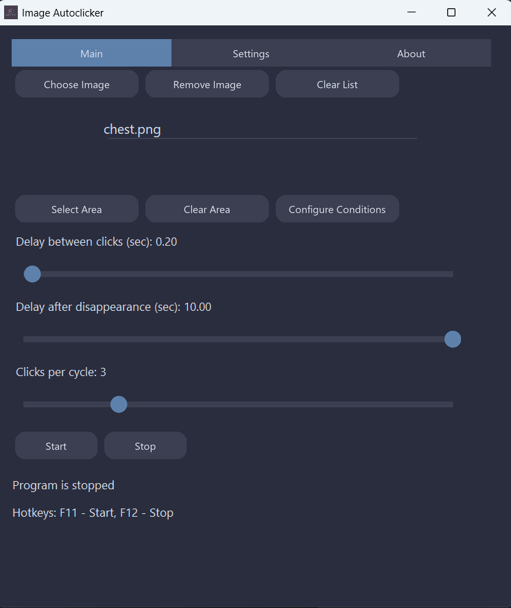
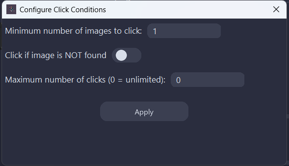
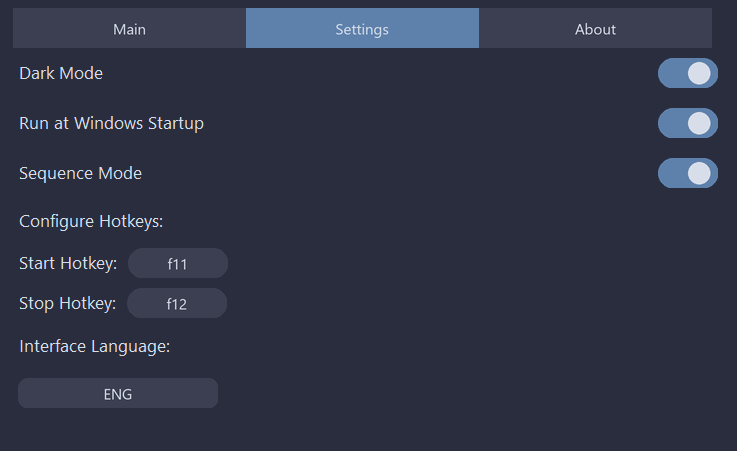
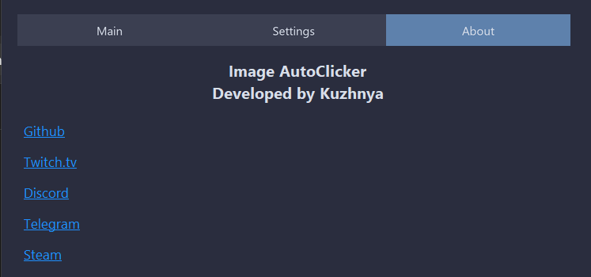

# AutoBongoChestClicks

After I started using Bongo Cat, I really enjoyed the loot chest mechanic and the cosmetic rewards — especially being able to sell them on the Steam marketplace.

However, I ran into a small problem: whenever I’m working (coding, writing, or doing something creative), I have to stop what I’m doing just to click the loot chest. It’s a small interruption, but it adds up.

That’s when I thought — why not make a lightweight tool that clicks for me when a specific image shows up? This way, I can stay focused and keep working without distractions.

So I built a simple desktop utility using Python — a platform I know and love.

---

## ✨ Why Use This Tool?

If you have repetitive actions on screen – this tool will help you automate them, saving both time and nerves.

Originally created for personal productivity, this project is now open-source. Feel free to:

- 📂 Explore the source code  
- 🔧 Build the app yourself  
- 💡 Suggest improvements
- 📦 [Download Latest Release](https://github.com/your-username/your-repo/releases/latest)  

---

## 🖥️ Main Interface

### Features:
- **Select Image** – Add one or multiple images for the app to search and click. Drag & drop is supported.
- **Search Area** – Limit detection to a specific region of the screen (e.g., top-right corner).
- **Clear** – Remove selected or all images.
- **Click Delay** – Adjust the delay between individual clicks.
- **Delay After Disappears** – How long to wait after the image disappears before rechecking.
- **Clicks per Cycle** – Number of clicks per image detection.
- **Start / Stop** – Control the app manually.
- **Status** – Displays whether the app is active.
- **Hotkeys** – Displays currently assigned keyboard shortcuts.

---

## ⚙️ Configure Conditions

  
Clicking this opens the advanced conditions window:

### Advanced Options:
1. **Min Images Required to Click** – Only click when a set number of identical images (e.g., 3 or more) are detected.
2. **Click if Image NOT Found** – If no target image is detected, it clicks the center of the selected area.
3. **Max Number of Clicks** – Automatically stops the app after a certain number of clicks.

---

## 🛠️ Settings Tab

- **Dark Mode** – Toggle light/dark themes.
- **Run on Windows Startup** – Starts app with Windows (current user only).
- **Sequence Mode** – Clicks images in the listed order. Disable to click any found image.
- **Hotkeys** – Click a field, then press any key to assign a shortcut.
- **Interface Language** – Choose between English and Russian (default: Russian).

---

## ℹ️ About Tab

Includes links to my other resources and contact information.

---

## 💡 Program Concept

This app is all about boosting productivity. Whether you’re working, studying, or dealing with repetitive visual tasks — this utility automates it for you.

### Highlights:
- 🧼 Clean, minimalist interface
- 🖼️ Load and manage multiple reference images
- ⏱️ Adjustable detection and click delays
- 🛑 Optional click limit
- 🗺️ Search in a defined screen area
- 📥 Drag & drop image support
- 🔁 Custom click conditions (e.g., multiple images must appear)

---

## 📌 Note

This tool was originally created for personal use but has grown into something potentially useful for others. Your contributions and feedback are welcome!
